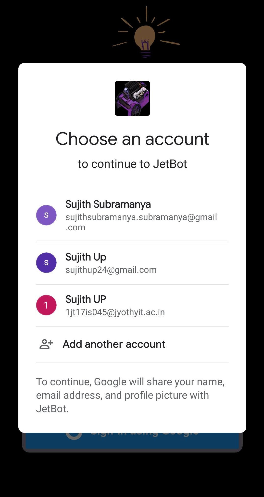
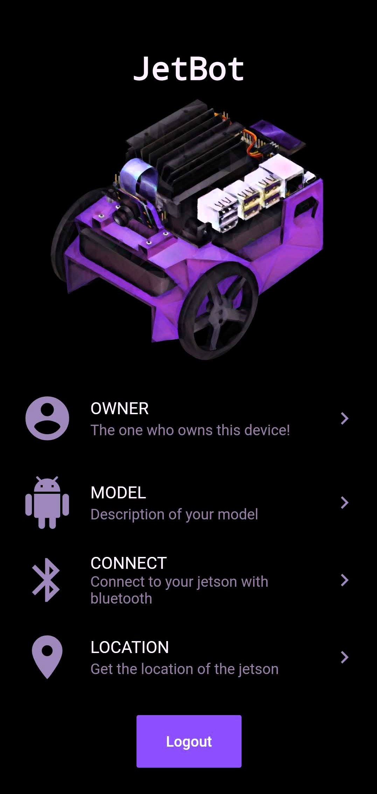

# Flutter
Designed the User interface and coded the App for Alltramatic, which is a USA startup company for AI Lawnmower.
This app includes:
1. Login Screen with Firebase Google-signin authentication.
2. Connect to the robot using bluetooth.
3. Displays details of the ownner.
4. Display location of the robot.

Demo:

Detailed Screenshots:

Login Screen: 

Authorizing Screen:

Main Screen:

About Us Screen:

Bluetooth Screen:

